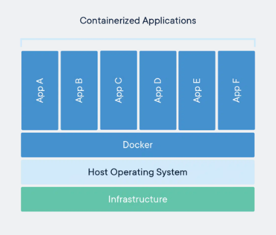

# Deploy and Scale like Google: Kubernetes 
Kubernetes (k8s, count the words in "ubernete") is an open source container orchestration tool that lets you scale your applications easily and prevents downtime. That's a lot of things, so let's break them down one by one to get a clearer idea.    
    
## Big apps come with big responsibilities 
You may have developed some simple backend and frontend application, for example an app that lets you add records to a database. But let's go even simpler and let's not think of the DB now, let's say you have a frontend that sends numbers to a backend and the backend returns that number multiplied by 2. You deploy your app to the internet and you are good to go, right? No, you are not. You would be if this app was used by you and your friends, but in a **production** (very heavily used wording that means someone paid a lot of money to have the app built and running) environment you can't just say you are done, because you face some issues:    
    
 - What if I get so many users that the server gets overloaded and becomes very slow?    
 - What if you want to update your application? For example, you want to now support division by 2    
 - What if the backend crashes or is bugged? Will you restart it manually at 3 a.m.?     
   
Kubernetes is what you need. Built by Google and open sourced in 2014, k8s solves all those issues, and more. Now that you know why Kubernetes matters we can start understanding how to use it.   
As a small note, I would like to point out that k8s is not one of those topics where you see results or effects immediatly. It's not like a cool physics experiment or a topic like machine learning where you can immediatly see results like recognizing images or generating text. You will not be able to just deploy a huge application and see k8s in action, keeping it alive when a server goes down and scaling it at will. But you will be able to try cool things like updating your app in real time, with no down time, which is super cool. If you need motivation to keep going, just think that every major company (Google, Amazon, Meta ...) all use Kubernetes extensively and that it will be a very useful tool if you want to persue a software engineer career. It is also useful to deploy machine learning models.  
  
## Microservices  
*Feel free to skip this paragraph if you already know what microservices are*  
When you develop a web app you may just write it as a normal program, like the first one you wrote in your life. That's called a *monolith*, because it's a big thing that needs to be started as a whole. This kind of structure has multiple issues  
  
 - If you want to update even one function, you will have to deploy the whole thing again  
 - If you want to scale the system, you must duplicate it as a whole, you can't duplicate only the functions that are getting more stress or that are heavier. Imagine an image processing backend, that takes an image and applies a convolution on it and then saves it to disk. Applying the convolution is an heavy operation that requires way more time than saving to disk. In a monolithic structure you have to duplicate the whole program, you can't just create more instances of the convolution part  
   
 This is when microservices come in. You take your program and you transform it in multiple small pieces, an example could be creating a service for each function in your code (you don't usually do this), so now you have a micro service for your convolution part of the code and a micro service to save the image to disk. Now you can easily duplicate the convolution part so that your app is not bottle necked by it. But wait, how do you *duplicate* thigs? What does it mean? Do you need to buy a new server? You'll need containers!   
  
## Containers  
*Feel free to skip this paragraph if you already know what containers are*  
To understand containers we first need to understand operating systems and virtual machines. An operating system runs on hardware, bare metal that executes calculations. So, to deploy your convolution app, you may follow the following reasoning:
 - Take a server, let's say a laptop
 - Fire up a Linux distribution, let's say Ubuntu
 - Start your convolution backend. Now users will send requests to it

Let's say you have many users, what can you do? Well, open a new terminal and launch another instance of your app. Wait, this causes all sorts of conflicts, they are listening on the same port for example. The main issue is that they are not separated and completely sealed one from each other, so when your application becomes complex you will face all sort of issues with this approach. You now decide to use multiple operating system instances instead of just one. To run an operating system, you need another computer, right? Not really, because some clever people created *virtual machines*, which basically is *virtual hardware*. Through something called an hypervisor, the virtual machines creates the illusion of hardware, for example creating a 2 core cpu when you have an 8 core cpu, or a disk with 200 GB of size when your disk is 1TB. On this fake hardware you can run operating systems. Now you can

 - Create 2 virtual machines
 - Start 2 operating systems
 - Open a terminal in each of them and launch the application

You now have two totally separate applications running, effectively doubling the speed of your program.
We're done right? Not really. Virtual machines are not very lightweight (even though they are pretty fast) and have one major drawback: you don't need a new full fledged operating system instance to run your app. You have 2 kernels for example, doing the same exact thing. Computer scientists really don't like when 2 pieces of code are running doing the same exact thing and wasting resources. (And you know who *really* doesn't like wasting resources? Companies, because resources cost money, and companies want to maximize the amount of money they have, so they don't want to spend it). 

Enter *containers*.

Containers solve the issue of having a duplicate kernel running by saying:

 - I'm running on Linux
 - I have, below me, a working Linux kernel, so I'm just going to use that

Now you go ahead, download **Docker**, the most widely used software to handle containers. Docker runs on the operating system and containers run on top of Docker.



Containers have many other advantages, like being very lightweight and fast to start, but we won't go into that. Now that you know what containers are, we can finally start talking about Kubernetes.

## Kubernetes motivation

You now want to scale the application to multiple servers, update your app in real time, be sure you have a certain number of instances running at all times. Kubernetes is what you need.
Kubernetes is an open source tool initially developed by Google and now maintained by the community. 


*Why is the Kubernetes logo a helm to drive boats around? Because it drives your boat full of containers in the ocean. The joke has gone too far at this point, it lives by itself, and we can't do anything about it.*

## Kubernetes basics

We could talk about the master node, etcd and many others low level things, but we won't. We will just talk about the basics, the things you need to know to understand some Kubernetes from a more practical point of view.

### Pods and Nodes

Pods are the smallest part in Kubernetes. A pod basically has a container inside itself, and that's it, a pod contains a container (pun intended?). It could actually have more containers, but usually just one. It also has an IP address! We'll see that we can use that to enable communication between microservices.
A pod runs inside a Node, which usually is a server. You can (and most certainly will) have multiple pods inside a node. Let's see how to create our first pod. To test this, you'll have to install [minikube](https://minikube.sigs.k8s.io/docs/start/). I will use ```kubectl``` in my examples, but remember that with minikube the command actually is ```minikube kubectl --```, but you can create an alias for it if you want.
To create a pod you need the image of a container. We will use ```nginx``` (search online what it's used for if you care), by default kubernetes will pull the images from DockerHub, a place where you can find many useful images. If you have dockerized your own app, you can use that too!
We will use ```yaml``` format to specify the configuration of the pod. If you are not familiar with ```yaml``` be careful with indentation.
```yaml
apiVersion: v1
kind: Pod
metadata:
  name: nginx
spec:
  containers:
  - name: nginx
    image: nginx:1.14.2
    ports:
    - containerPort: 80
```
Let's go through this
- ```apiVersion``` this specifies what api version of k8s to use. It won't always be ```v1```, it depends on the ```kind``` parameter. For example, you'll use a different one for ```Deployment```, which is something we'll see later.
- ```kind``` is the type of entity we want to create. There are many types of things you may want to create, for example ```Service, Secret, Namespace, Pod, Job, ...```
- ```metadata``` here you specify the name of your pod
- ```spec``` this is usually the bigger part of your specification. In this case we only specify the ```containers``` part, where ```name``` is the name you want to give to the container, ```image``` is the image to use (it will be auto pulled from DockerHub) and ```ports``` is where the port ```nginx``` will listen to. In the ```yaml``` format, the ```-``` specifies a list. As you can see ```containers``` has a ```-``` because you can specify multiple containers, and also ```ports```.

You can now save your file. Call it what you want, I will call it ```nginx-pod.yaml``` and execute the command ```kubectl apply -f nginx-pod.yaml```. You are done! You now deployed your first pod, to see it working you can execute the command ```kubectl get pods```. 

### Deployment

A pod is *ephemeral*, which means that it can die at any time. If you want to ensure that a pod runs at any time, you can use a deployment. Here's a very basic deployment example
```yaml
apiVersion: apps/v1
kind: Deployment
metadata:
  name: nginx-deployment
  labels:
    app: nginx
spec:
  replicas: 3
  selector:
    matchLabels:
      app: nginx
  template:
    metadata:
      labels:
        app: nginx
    spec:
      containers:
      - name: nginx
        image: nginx:1.14.2
        ports:
        - containerPort: 80
```
Here we see some new things.
- Notice ```apiVersion``` is now different, you need to specify that one if you want to use deployments
- ```labels``` basically are key-value pairs that you can use to identify your pods. In this case we are using ```app: nginx```, which means that we are labeling our pods with the key ```app``` and the value ```nginx```. We will see later how to use these labels.
- ```replicas``` is the number of pods you want to run. In this case we want 3 pods running at all times. We'll talk about this later in more detail
- ```selector``` is used to select the pods you want to run. In this case we are using the same label we used before, ```app: nginx```. This means that we want to run pods that have the label ```app: nginx```.
- ```template``` is the template of the pods you want to run. In this case we are using the same template we used before, so we are running pods with the same label and the same image.
- ```labelFrom``` is a new thing. It basically says that the label of the deployment is the same as the label of the pods. This is useful because you can now use the label of the deployment to select the pods. For example, if you want to delete all the pods of a deployment, you can just delete the deployment and all the pods will be deleted too.

Let's try to make labels a bit clearer. The ```matchLabels``` field specifies the label selector that the Deployment controller uses to identify which pods to manage. It looks for pods with the label ```app: nginx```. This association ensures that the Deployment only manages pods that match the specified labels, and not others. This will match ```app: nginx``` in the ```template.metadata```, so the deployment controller will identify this pod and manage it.
You can now execute ```kubectl apply -f deployment.yaml```. To check your deployment, execute ```kubectl get deployments```.

## Namespaces
Namespaces are commonly used by programmers and they offer various advantages, for example giving the same name to elements in different namespaces. Kubernetes implements namespaces and you can by this point guess that you just have to add some fields to your ```yaml``` file. Here's an example:
```yaml
apiVersion: apps/v1
kind: Deployment
metadata:
  name: nginx-deployment
  namespace: my-namespace
  labels:
    app: nginx
spec:
  # your spec
```
## Replicas and ReplicaSet
A ReplicaSet is a lower level abstraction that ensures that you have a certain number of pods running everytime. It doesn't support rolling updates, and it's usually managed by a deployment. So you will usually not specify a ```ReplicaSet``` but you will do something along these lines:
```yaml
apiVersion: apps/v1
kind: Deployment
metadata:
  name: nginx-deployment
  namespace: my-namespace
  labels:
    app: nginx
spec:
  replicas: 3 # replicas
  selector:
    matchLabels:
      app: nginx
  template:
    metadata:
      labels:
        app: nginx
    spec:
      containers:
      - name: nginx
        image: nginx:1.14.2
        ports:
        - containerPort: 80
```
Now you are sure that 3 instances of your container are always running at once. Pretty straight forward uh?

*Note: rolling updates is a deployment strategy that allows you to have minimal downtimes between updates. Kubernetes basically gradually removes old version pods while creating the new ones.*

## Config Maps and Secrets
In your application you may have many variables, for example ```containerPort```. It is not a good idea to hard code them in your ```yaml``` file, especially if you have multiple configuration files and those variables are shared between them (you would have to update all of them one by one in each). Kubernetes offers you the option to create config maps.
```yaml
kind: ConfigMap 
apiVersion: v1 
metadata:
  name: my-configmap 
data:
  # Configuration values can be set as key-value properties
  database: mongodb
  database_uri: mongodb://localhost:27017
```
Now that you have a ConfigMap (you deploy it with the same exact command ```kubectl apply -f```) you can use them in your other ```yaml``` files.
Then, in your deployment file, you can do
```yaml
env:
  - name: DATABASE # give this variable the name of the env variable needed
    valueFrom:
      configMapKeyRef:
        name: my-configmap
        key: database
  - name: DATABASE_URI
    # can you complete it by yourself? Just reference the one above
```
Secrets are very similar to config map, but they are base64 encoded. This is not the most secure thing in the world because if someone finds your base64 encoded password and decodes it he will be able to see it. 
```
apiVersion: v1
kind: Secret
metadata:
  name: my-secret
type: Opaque
stringData:
  username: my-username
  password: my-password
```
After you apply it, you can use
```
apiVersion: v1
kind: Pod
metadata:
  name: my-app-pod
spec:
  containers:
  - name: my-app-container
    image: my-app-image:v1
    env:
      - name: APP_USERNAME
        valueFrom:
          secretKeyRef:
            name: my-secret
            key: username
      - name: APP_PASSWORD
        valueFrom:
          secretKeyRef:
            name: my-secret
            key: password
  restartPolicy: Never
```
To reference it! Nice. Be careful that you can't just write ```my-username``` and ```my-password``` but you have to base64 encode it. To do so you can use online tools or this bash command:
```bash
echo -n 'my-password' | base64
```
## Conclusion (sanity check)
Well, we've gone from knowing nothing about anything to knowing something. You now know:
- Microservices
- Containers
- Kubernetes basics: Pod, Deployment, Namespaces, Replicas, Config Maps and Secrets

Congratulations, you now know the basics of Kubernetes and you are ready to use it, making your application as reliable, scalable and beautiful as the ones deployed by huge companies like Google or Amazon.